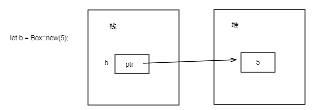

# 3.16.2 Box智能指针

```Box```智能指针是Rust中最基本的在堆上分配内存的方式。定义```Box```变量，将值存放在堆上，栈上则保留指向堆数据的指针。除了数据被存储在堆上外，```Box```没有任何性能损失。

## 1. Box的基本使用方式

下面为```Box```使用的简单示例：
```Rust
fn main() {
    let b = Box::new(5); //此时5存储在堆上而不是栈上，b本身存储于栈上
    println!("b = {}", b); //离开作用域时同时清楚堆和栈上的数据
}
```

## 2. 使用Box的内存布局

前面示例中使用```Box```定义了变量```b```，其内存布局方式如下：



## 3. Box适合使用的场景

```Box```适合用于如下场景：
- 当有一个在编译时未知大小的类型，而又需要在确切大小的上下文中使用这个类型值的时候；
- 当有大量数据并希望在确保数据不被拷贝的情况下转移所有权的时候；
- 当希望拥有一个值并只关心它的类型是否实现了特定```trait```而不是其具体类型时。

### （1）场景1示例：
假定我们需要采用递归的方式定义一个```List```，其定义可能如下：
```Rust
// 下面的代码无法编译通过
use crate::List::{Nil, Cons};
enum List {
    Cons(i32, List),//Cons就类似于c语言的结构体定义：
                 //struct List{
                 //  int data;
                 //  struct List next;//编译报错，因为编译器并不知道next有多大，next又是一个List
                 //}
    Nil,
}

fn main() {
    let _list = Cons(1, Cons(2, Cons(3, Nil)));
}
```
但是上面的代码无法编译通过，因为```Cons```类型在编译时无法确定其具体大小。其内存示意图如下：


此时就需要使用Box，其代码如下：
```Rust
use crate::List::{Nil, Cons};
enum List {
    Cons(i32, Box<List>),   // 用Box就把它变成了一个指针，Cons就类似于c语言的结构体定义：
                            // struct List{
                            //   int data;
                            //   struct List *next; //指向的一个指针，指针的大小是固定的
                            // }
    Nil,
}

fn main() {
    let _list = Cons(1, Box::new(Cons(2, Box::new(Cons(3, Box::new(Nil))))));
}
```
使用Box后，上面的Cons的内存表示如下：


每个Box的大小是固定的，所以编译不会有问题。

### （2）场景2示例：
```Rust
fn main() {
    let b = Box::new([100u32; 100]);
    println!("b = {:?}", b);

    let c = b;
    // println!("b = {:?}", b);  // 此行打开将报错，因为所有权已经转移到c
    println!("c = {:?}", c);
}
```

### （3）场景3示例：
```Rust
trait Vehicle {
    fn run(&self);
}

struct Car(u32);

impl Vehicle for Car {
    fn run(&self) {
        println!("Car {:?} run ... ", self.0);
    }
}

struct Truck(u32);

impl Vehicle for Truck {
    fn run(&self) {
        println!("Truck {:?} run ... ", self.0);
    }
}

//vehicle_run方法的参数要求是一个Vehicle trait对象
fn vehicle_run(vehicle: Box<dyn Vehicle>) {
    vehicle.run();
}

fn main() {
    let car = Car(1001);
    let truck = Truck(1002);

    let v1 = Box::new(car);
    vehicle_run(v1);
    let v2 = Box::new(truck);
    vehicle_run(v2);
}
```

