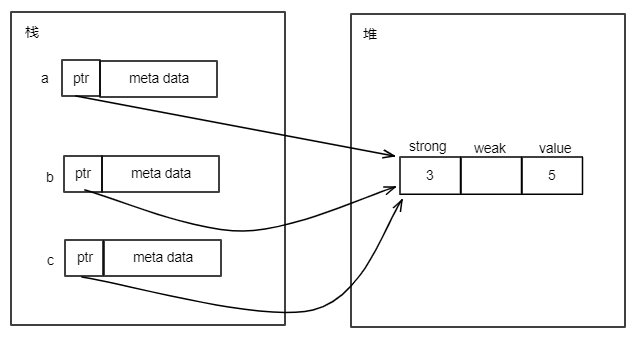
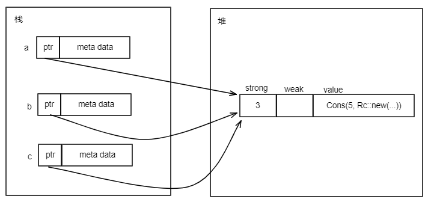

# 3.16.5 Rc智能指针

## 1. 使用场景分析

假定有这样一个需求，希望创建两个共享第三个列表所有权的列表，其概念类似于如下图：


根据前面的知识，可能写出来的代码如下：

```Rust
enum List {
    Cons(i32, Box<List>),
    Nil,
}
use crate::List::{Cons, Nil};
fn main() {
    let a = Cons(5, Box::new(Cons(10, Box::new(Nil))));
    let b = Cons(3, Box::new(a));
    let c = Cons(4, Box::new(a));
}
```

但是上面的代码报错，因为**Rust 所有权机制要求一个值只能有一个所有者**。为了解决此类需求，Rust提供了Rc智能指针。

## 2. 使用Rc共享数据

Rc智能指针通过引用计数解决数据共享的问题，下面是Rc使用的简单代码：

```Rust
use std::rc::Rc;
fn main() {
    let a = Rc::new(5u32);
    let b = Rc::clone(&a);
    let c = a.clone();
}
```

上面代码中，a、b、c就共享数据5。当创建b时，不会获取a的所有权，会克隆a所包含的Rc(5u32)，这会使引用计数从1增加到2并允许a和b共享Rc(5u32)的所有权。
创建c时也会克隆 a，引用计数从2增加为3。每次调用`Rc::clone`，Rc(5u32)的引用计数都会增加，直到有零个引用之前其数据都不会被清理。其在内存中的表示如下：



前面共享列表的需求则可以使用Rc实现如下：
```Rust
enum List {
    Cons(i32, Rc<List>),
    Nil,
}
use crate::List::{Cons, Nil};
use std::rc::Rc;
fn main() {
    let a = Rc::new(Cons(5, Rc::new(Cons(10, Rc::new(Nil)))));
    let b = Cons(3, Rc::clone(&a));
    let c = Cons(4, a.clone()); //此处使用a.clone()也是ok的
}
```

对应的内存示意图如下：




## 3. 打印Rc的引用计数

下面的示例打印了Rc的引用计数：

```Rust
enum List {
    Cons(i32, Rc<List>),
    Nil,
}
use crate::List::{Cons, Nil};
use std::rc::Rc;
fn main() {
    let a = Rc::new(Cons(5, Rc::new(Cons(10, Rc::new(Nil)))));
    println!("count after creating a = {}", Rc::strong_count(&a));
    let _b = Cons(3, Rc::clone(&a));
    println!("count after creating b = {}", Rc::strong_count(&a));
    {
        let _c = Cons(4, Rc::clone(&a));
        println!("count after creating c = {}", Rc::strong_count(&a));
    }
    println!("count after c goes out of scope = {}", Rc::strong_count(&a));
}
```

使用Rc需要注意以下两点：

- 通过Rc是允许程序的多个部分之间**只读的共享数据**，因为相同位置的多个可变引用可能会造成数据竞争和不一致。如果涉及到修改，需要使用RefCell或者Mutex。
- Rc只能是同一个线程内部共享数据，它是非线程安全的。如果要在多线程中共享，需要使用Arc。
