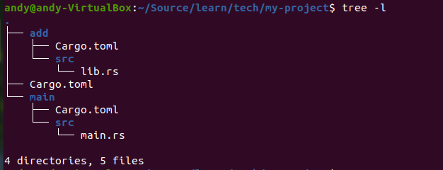

# 3.17.4 工作空间
**工作空间** 是一系列共享同样的 Cargo.lock 和输出目录的包。使用工作空间，可以将多个crate放在同一个目录下，通过共享依赖来提供更好的代码组织和构建支持。
假定有一个项目my-project，里面包含两个crate，分别是二进制crate main和库crate add，在crate main的代码中使用crate add的功能。下面的示例通过工作空间来组织和管理crate。

## 1.创建整个工程
命令如下：
```
mkdir my-project
cd my-project
```

## 2.创建crate add
命令如下：
```
cargo new add --lib
```

## 3.编写crate adder的代码
编辑add/src/lib.rs如下：
```Rust
// add/src/lib.rs
pub fn add(left: u32, right: u32) -> u32 {
    left + right
}
```

## 4.创建crate main
命令如下：
```
cargo new main
```

## 5.编辑工作空间管理的Cargo.toml
在my-project目录下，创建Cargo.toml，内容如下：
```TOML
# my-project/Cargo.toml
[workspace]
members = [
        "./main", 
        "./add",
]
```

## 6.给crate main添加对crate add的依赖

编辑后的main/src/Cargo.toml如下：
```TOML
[package]
name = "main"
version = "0.1.0"
edition = "2021"

[dependencies]
add = { path = "../add" } # 添加这行：添加对crate add的依赖
```

## 7.在crate main的代码中使用crate add的代码

编辑main/src/lib.rs如下：
```Rust
// main/src/lib.rs
use add::*;
fn main() {
    let ret = add(10u32, 21u32); // 使用crate add的add函数
    println!("ret = {:?} !", ret);
}
```

在上面的示例中，通过my-project/Cargo.toml文件管理了main和add两个crate，上面所有步骤完成后，整个项目构成如下：



在my-project目录下或者my-project/main目录下运行cargo run可以编译执行整个项目。
