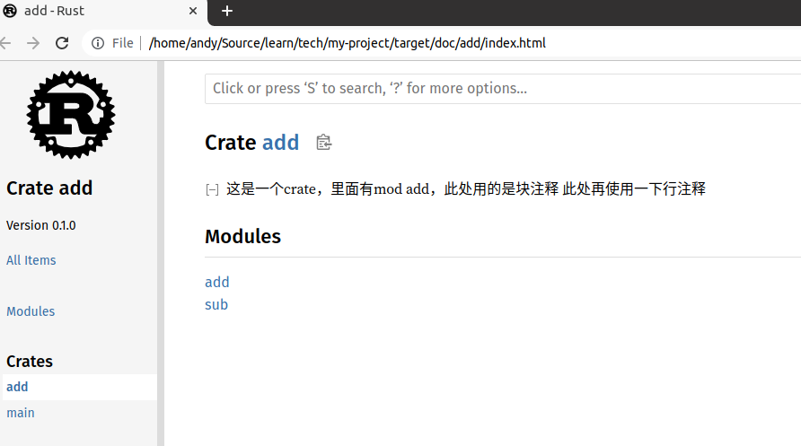

# 3.19 再谈注释
## 3.19.1 包和模块级别的注释
包和模块的注释分为两种：行注释//!和块注释/*! ... */，这些注释需要添加到文件的最上方。示例如下：
```Rust
/*!
这是一个crate，里面有mod add，此处用的是块注释 
*/
//! 此处再使用一下行注释 
mod add;
pub mod sub;
```
运行cargo doc --open出现如下界面：



而下面的示例因为没有将所有的包注释放在文件最上面，所以会报错：
```Rust
/*!
这是一个crate，里面有mod add，此处用的是块注释 
*/
pub mod add;

//! 这是一个mod sub，此处用的是行注释，这行将报错，因为必须放置到文件的最上方
pub mod sub;
```


3.17.2 文档测试
1. 文档测试
Rust运行在文档注释中写测试用例，示例如下：
/// `add` 将两个值相加
///
/// 下面是测试用例
/// ```
/// let ret= add::add::add(5u32, 6u32);
///
/// assert_eq!(11u32, ret);
/// ```
pub fn add(left: u32, right: u32) -> u32 {
    left + right
}
测试用例的内容用一对```包含，上面的代码在运行cargo test时，将会运行注释中的测试用例。

2. 保留测试，隐藏注释
还可以保留文档测试的功能，但是把测试用例的内容在文档中隐藏起来，示例如下：
/// `add` 将两个值相加
///
/// 下面是测试用例
/// ```
/// let ret= add::add::add(5u32, 6u32);
///
/// assert_eq!(11u32, ret);
/// ```
pub fn add(left: u32, right: u32) -> u32 {
    left + right
}

/// 下面是测试用例
/// ```
/// # // 使用#开头的行会在文档中被隐藏起来，但是依然会在文档测试中运行
/// # let ret= add::add::add2(5u32, 6u32);
/// # assert_eq!(Some(11u32), ret);
/// ```
pub fn add2(left: u32, right: u32) -> Option<u32> {
    Some(left + right)
}
运行cargo test，可以看到运行了用例add::add2，如下：
[图片]
运行cargo doc --open后，打开add和add2的文档，分别如下：
[图片]
[图片]
可以看到add2对应的测试用例的内容在文档中被隐藏了。

3.17.3 文档注释中的其它技巧
1. 跳转
Rust文档注释中还可以进行跳转。在文档注释中用[``]包含的内容，可以对其进行跳转，示例如下：
/// `sub` 返回一个[`Option`]类型
/// 跳转到[`crate::add`]
pub fn sub(left: u32, right: u32) -> Option<u32> {
    Some(left - right)
}
运行cargo doc --open后，出现如下：
[图片]
从上图中，点击红色划线部分将分别跳转到标准库的Option和crate::add的位置。

2. 文档搜索别名
可以在Rust文档中为类型定义搜索别名，以便更好的进行搜索，示例如下：
#[doc(alias("x"))]
pub struct A;
运行cargo doc --open后，出现如下：
[图片]
