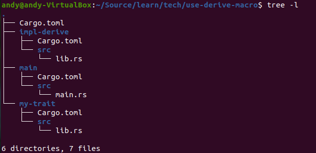
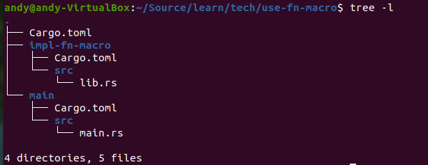

# 3.23.2 过程宏
过程宏接收Rust代码作为输入，在这些代码上进行操作，然后产生另一些代码作为输出，而非像声明式宏那样匹配对应模式然后以另一部分代码替换当前代码。

过程宏分为三类，分别如下：

- 自定义derive宏，在结构体、枚举等类型上通过#[derive()]指定derive属性添加代码；
- 类属性宏，定义可用于任意项的自定义属性；
- 类函数宏，看起来像函数但是作用于作为参数传递的Token。

## 1. 自定义derive宏
在本书之前就已经见到过的结构体上的#[derive(Copy, Debug, Clone)]就是自定义derive宏，其功能实际上就是为类型生成对应的代码。例如下面的代码：
```Rust
#[derive(Copy)]
struct A {
    a: u32,
}
```

对结构体A加上#[derive(Copy)]宏会为结构体A生成实现Copy trait的相关代码。所以使用自定义derive宏实际上涉及到三部分代码，分别是：

- 要生成的目标代码，例如对于#[derive(Copy)]来说，其目标代码实际上就Copy trait的实现代码；
- 为类型生成目标代码的代码；
- 在类型上标注的#[derive(xx属性)]。

下面给出一个完整的自定义derive宏的示例，整个项目的目录如下：



整个项目中有三个crate，功能分别如下：

- my-trait中定义了一个MyTrait trait；
- impl-derive中是为某个类型实现MyTrait trait的代码，提供了MyDeriveMacro宏，当在某个类型上面加上#[derive(MyDeriveMacro)]就会自动为它实现MyTrait；
- main中定义了一个结构体，使用上面的MyDeriveMacro宏。

最外层的Cargo.toml中定义了工作空间，内容如下：
```TOML
[workspace]
members = [
        "./main", 
        "./impl-derive",
        "./my-trait",
]
```

### （1）实现my-trait
- 运行cargo new my-trait --lib创建；
- 编写src/lib.rs代码如下：
```Rust
// my-trait/src/lib.rs
pub trait MyTrait{  // 定义MyTrait
    fn do_something();
}
```

### （2）实现impl-derive
- 运行cargo new impl-derive --lib创建；
- 在Cargo.toml中添加依赖，如下：
```TOML
# impl-derive/Cargo.toml
[package]
name = "impl-derive"
version = "0.1.0"
edition = "2021"

# See more keys and their definitions at https://doc.rust-lang.org/cargo/reference/manifest.html

#######################
# 下面的几行为添加的内容
#######################
[lib]
proc-macro = true  

[dependencies]
syn = "2.0.15"
quote = "1.0.26"
```

- 编写src/lib.rs如下：
```Rust
// impl-derive/src/lib.rs
extern crate proc_macro;
use crate::proc_macro::TokenStream;
use quote::quote;
use syn;

// 为某个类型实现MyTrait
fn impl_mytrait(ast: &syn::DeriveInput) -> TokenStream {
    let name = &ast.ident;
    let gen = quote! {
        impl MyTrait for #name {
            fn do_something() {
                println!("Do something, my name is {}", stringify!(#name));
            }
        }
    };

    gen.into()
}

// 把宏和函数对应起来，如果类型上面加了#[derive(MyDeriveMacro)]
// 就类似于是为其调用impl_mytrait_derive函数
#[proc_macro_derive(MyDeriveMacro)]
pub fn impl_mytrait_derive(input: TokenStream) -> TokenStream {
    let ast = syn::parse(input).unwrap(); //DeriveInput
    impl_mytrait(&ast)
}
```

### （3）实现main
- 编写Cargo.toml文件为其添加依赖：
```TOML
[package]
name = "main"
version = "0.1.0"
edition = "2021"

# See more keys and their definitions at https://doc.rust-lang.org/cargo/reference/manifest.html

[dependencies]
my-trait = {path = "../my-trait"}  # 添加这行
impl-derive = {path = "../impl-derive"} # 添加这行
```

- 编写src/lib.rs：
```Rust
// main/src/lib.rs
use my_trait::MyTrait;
use impl_derive::MyDeriveMacro;

#[derive(MyDeriveMacro)] // 使用MyDeriveMacro宏后，就为Main实现了MyTrait
struct Main;

fn main() {
    Main::do_something(); // 因为实现了MyTrait，所以可以调用do_something函数
}
```

## 2. 类函数宏
类函数宏是类似于函数那样的过程宏，下面的工程演示类函数宏，其目录结构如下：



### （1）定义工作空间
编写最外层的Cargo.toml文件，内容如下：
```TOML
[workspace]
members = [
        "./main",
        "./impl-fn-macro",
]
```

### （2）实现impl-fn-macro
- 修改impl-fn-macro/Cargo.toml文件如下：
```TOML
# impl-fn-macro/Cargo.toml文件

...

[lib]   # 添加这行
proc-macro = true # 添加这行
```

- 编写impl-fn-macro/src/lib.rs如下：
```Rust
// impl-fn-macro/src/lib.rs
use proc_macro::TokenStream;

#[proc_macro]
pub fn make_answer(_item: TokenStream) -> TokenStream {
    "fn answer() -> u32 { 42 }".parse().unwrap()  // 生成answer函数
}
```

### （3）实现main
- 添加main需要的依赖，修改main/Cargo.toml如下：
```TOML
# main/Cargo.toml文件

[dependencies]
impl-fn-macro = {path = "../impl-fn-macro"}  # 添加这行
```

- 编写main/src/main.rs代码如下：
```Rust
// main/src/main.rs
use impl_fn_macro::make_answer;
make_answer!(); // 调用函数宏生成answer函数

fn main() {
    println!("{}", answer());
}
```

## 3. 类属性宏
属性宏和自定义derive宏类似，不同的是derive宏生成代码，而类属性宏可以创建新的属性。自定义derive宏只能用于结构体和枚举，属性宏则还可以用于其它的项，如函数。下面的工程演示类属性宏，其目录结构如下：


### （1）定义工作空间
编写最外层的Cargo.toml文件，内容如下：
```TOML
[workspace]
members = [
    "./main",
    "./impl-attr-macro",
]
```

### （2）实现impl-attr-macro
impl-attr-macro中实现了类属性宏func_info。
- 修改impl-attr-macro/Cargo.toml文件如下：
```TOML
# impl-attr-macro/Cargo.toml文件

...

## 添加下面2行
[lib]  
proc_macro = true

[dependencies]
## 添加下面3行
syn = { version = "2.0.15", features = ["parsing", "extra-traits","full", "visit"] }
quote = "1.0.26"
proc-macro2 = "1.0.56"
```

- 编辑impl-attr-macro/src/lib.rs文件如下：
```Rust
use proc_macro::TokenStream;
use quote::quote;
use syn::{parse_macro_input, ItemFn};

// 定义属性宏，属性宏的名字就叫做func_info
#[proc_macro_attribute]
pub fn func_info(_: TokenStream, input: TokenStream) -> TokenStream {
    let mut func = parse_macro_input!(input as ItemFn);
    let func_name = &func.sig.ident;
    let func_block = &func.block;
    let output = quote! {
        {
            println!("fun {} starts", stringify!(#func_name));
            let __log_result = { #func_block };
            println!("fun {} ends", stringify!(#func_name));
            __log_result
        }
    };
    func.block = syn::parse2(output).unwrap();
    quote! { #func }.into()
}
```

### （3）实现main
- 添加main需要的依赖，修改main/Cargo.toml如下：
```TOML
# main/Cargo.toml文件

[dependencies]
impl-attr-macro = {path = "../impl-attr-macro"}  # 添加这行
```

- 编写main/src/main.rs代码如下：
```Rust
// main/src/main.rs
use impl_attr_macro::func_info;

#[func_info] // 为foo函数添加属性宏
fn foo() {
    println!("Hello, world!");
}

fn main() {
    foo();  // 会自动加上属性宏中的内容
}   
```

