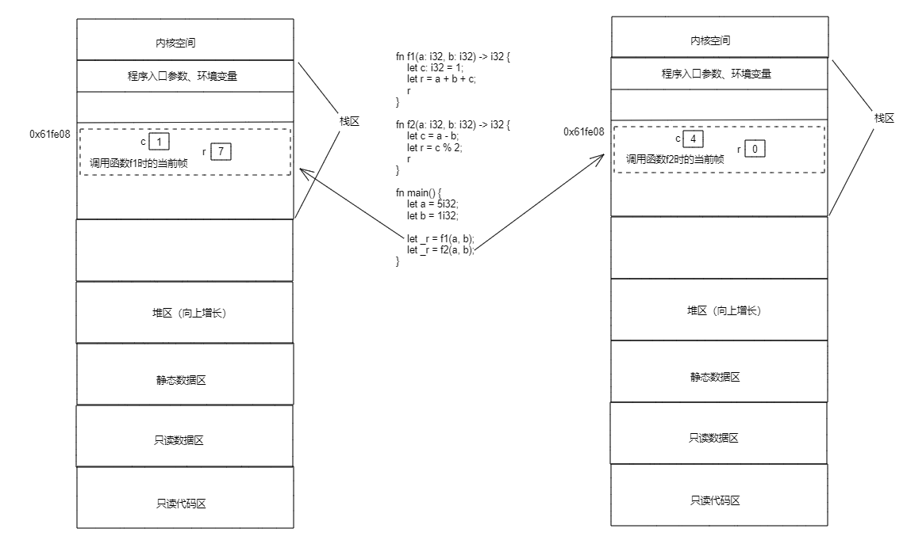
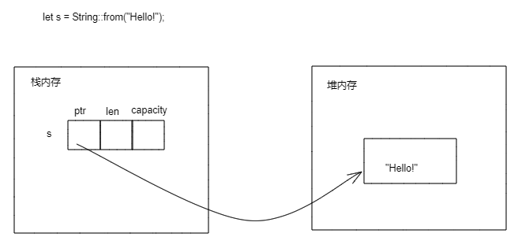

## 3.6 Rust内存模型
### 3.6.1 Rust程序内存布局


上图是一张linux系统上Rust程序的内存布局图。在linux操作系统中，会划分固定的区域给内核使用，即上图中的内核空间；应用程序使用的是用户空间。

Rust程序使用的内存空间分为如下：
- 只读代码区（Instructions）：存放可执行代码的区域。
- 只读数据区（Literals）：存放代码的文字常量的区域。
- 静态数据区（Static Data）：一般的静态函数、静态局部变量、静态全局变量的存放区域，在程序启动的时候初始化。
- 堆区（Heap）：程序代码中动态分配的内存，在程序运行时申请，该区域向上增长。
- 栈区（Stack）：该区域存放函数调用的参数、局部变量和返回地址等信息，在编译阶段分配，向下增长。

### 3.6.2 栈和堆
#### 1.栈和栈帧
“栈和栈帧属于操作系统的概念，由操作系统进行管理，栈空间以后进先出的顺序存储数据。将数据放到栈上就做入栈，将数据移出栈就做出栈。
每次调用函数时，操作系统会在栈顶创建一个栈帧来保存函数的上下文数据（主要是函数内部声明的局部变量），函数返回时返回值也会存储在该栈帧中。当函数调用者取得该函数返回值后，栈帧会被释放。”引用自《Rust入门秘籍》。

```Rust
fn f1(a: i32, b: i32) -> i32 {
    let c: i32 = 1;
    let r = a + b + c;
    r
}

fn f2(a: i32, b: i32) -> i32 {
    let c = a - b;
    let r = c % 2;
    r
}

fn main() {
    let a = 5i32;
    let b = 1i32;

    let _r = f1(a, b);
    let _r = f2(a, b);
}
```
对于上面的代码，在执行第17行和第18行的栈帧示意图如下：


这里需要注意的是两个帧对应同样的内存地址，这是因为在调用完f1函数后，其对应的栈帧释放（释放的实际意义就是这段内存可以被重新分配了），然后调用f2函数为其分配栈帧时从同样的地址进行分配。

#### 2. 堆
堆空间和栈空间不同，不由操作系统管理，在需要时申请，不需要时释放。申请和释放堆内存是一件困难的事情，尤其当程序代码较多时。只申请堆内存而不释放会造成内存泄露，内存泄露过多会造成内存耗尽而崩溃。错误的释放在使用的内存也会造成程序运行错误（或直接无法运行）。
有些编程语言使用提供垃圾管理回收器（GC）来自动回收不再使用的堆内存，有些语言必须完全由程序员在代码中手动申请和释放内存。
Rust没有GC，但通过其独特的机制管理内存，程序员不用手动申请和释放堆内存。

#### 3. Rust如何使用堆和栈
栈中存储的所有数据都必须占用（在编译时就）已知且固定的大小。编译时大小未知或可能变化的数据，存储在堆上。
数据存放到栈上时，是直接将数据放到栈内存。
当数据需要存放到堆上时，内存分配器则是根据数据的大小，在堆内存找到合适大小的空区域存放，把它标记为已使用，并返回一个表示该位置地址的指针。该指针存储在栈上，当需要访问具体的数据时，必须先访问指针，然后通过指针找到堆上的位置，从而访问数据。这个过程可以用下图表示：

