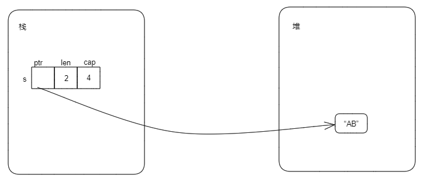

## 3.7.所有权(Ownership) ---------- andy
### 3.7.1 所有权介绍
所有权是Rust最为与众不同的特性，它让Rust无需垃圾回收即可保证内存安全。

#### 1. 所有权规则

Rust所有权的规则如下：

- Rust中的每个值都有一个被称为其所有者的变量，即值的所有者是某个变量；
- 值在任何时刻有且仅有一个所有者；
- 当所有者离开作用域后，这个值将丢弃。
```Rust
fn main() {
    let a: u32 = 8;
    let b: String = String::from("hello");
    let c: Vec<u8> = vec![1, 2, 3];
}
```

上面的代码中，a就是8的所有者，b是String::from("hello")的所有者，c则是vec![1, 2, 3]的所有者。

注意：b是String::from("hello")的所有者，但是b不是字符串"hello"的所有者。同理，c是vec![1, 2, 3]的所有者，但不是[1, 2, 3]的所有者。至于为什么，后续内容（String类型部分）会进行讲解。

#### 2. 变量的作用域
变量作用域是变量在程序中有效的范围。一对花括号表示的范围就是作用域，变量有效的范围就是从创建开始，到离开作用域结束。
示例1：
```Rust
fn f() {
    let b = 1u32;           // --------------------------------|
    let c = 2u32;           //-----------|                     |             
                            //           |                     |
                            //           |                     |---b的作用域范围
    println!("b = {:?}", b);//           |--c的作用与范围       |
    println!("c = {:?}", c);//           |                     |
                            //-----------|  -------------------|         
}

fn main() {
    let a: u32 = 8;   // ----------------------------|
    println!("a = {:?}", a);                      // |
                                                  // | ---- a 的作用域范围
    f();                                          // |
//---------------------------------------------------|
}
```

示例2：
```Rust
fn main() {
    let a = 8u32;                 // --------------------------|
    {                             //                           |
        let b = 5u32;             // -------|                  |
        println!("a = {:?}", a);  //        |--b的作用域范围    |
        println!("b = {:?}", b);  //        |                  |-----a的作用域范围
                                  // -------|                  |
    }                             //                           |
    println!("a = {:?}", a);      //                           |
                                  // --------------------------|
}
```

#### 3. String类型

- String类型的创建

  - String::from
  - to_string
  - String::new
```Rust
fn main() {
    let s1 = String::from("Hello");  // 方法一
    let s2 = "Hello".to_string();    // 方法二

    let mut s3 = String::new();      // 方法三
    s3.push('H');
    s3.push('e');
    s3.push('l');
    s3.push('l');
    s3.push('o');
    s3.push('!');

    println!("s1: {:?}", s1);
    println!("s2: {:?}", s2);
    println!("s3: {:?}", s3);
}
```

- String类型的本质

Rust标准库中，String类型的定义如下：
```Rust
pub struct String {
    vec: Vec<u8>,
}
```
Vec类型的定义如下：
```Rust
pub struct Vec<T> {
    buf: RawVec<T>,  
    len: usize,      // 长度
}
```
RawVec定义则类似于如下（为了更好的说明String类型，下面的定义用简化的代码）：
```Rust
struct RawVec<T> {
    ptr: NonNull<T>,    // 指针
    cap: usize,         // 容量
}
```
那对于整个String类型，可以用伪代码表示如下：
```Rust
struct String {
    v: struct Vec<u8> {
            raw_vec: RawVec{ptr: NonNull<u8>, cap: usize},
            len: usize,
        }
}
```
更进一步的简化，可以得到String类型本质如下：
```Rust
struct String {
    ptr：NonNull<u8>, 
    cap: usize，
    len: usize,
}
```
所以String类型本质是三个字段：一个指针，一个容量大小，一个长度大小。

- 内存分配

在Rust中，编译时大小确定的数据放在栈上，编译时大小不能确定的数据放在堆上。考虑如下代码：
```Rust
fn main() {
    let mut s = String::new();
    s.push('A');
    s.push('B');

    println!("{s}");  // 打印AB
}
```
在第2行定义String类型时，并不能确定最终字符串的大小，所以字符串内容本身应该存储在堆上。结合什么String类型的本质的内容，可以得到String类型的存储如下：

