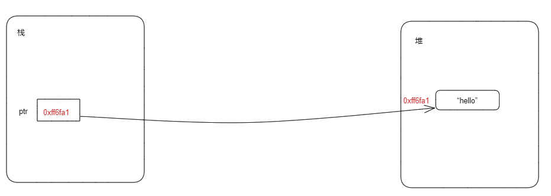

### 3.7.2 引用与借用
考虑如下代码：
```Rust
fn main() {
    let s2 = String::from("hello");
    print(s2);
    // println!("s2 is {:?}", s2);  //打开报错，s2的所有权在上一行已经移动到print函数，
                                    //此处无法再使用
}

fn print(s: String) {
    println!("s is: {:?}", s);
}
```
第4行打开注释编译将发送错误，因为s2的所有权在第3行已经转移到print函数中了，s2将不再有效，因此第4行不能再使用。

如果要在调用print函数后仍然能使用s2，根据本书目前学过的Rust知识，则需要将所有权再从函数转移到变量，然后使用，代码如下：
```Rust
fn main() {
    let s2 = String::from("hello");
    let s3 = print(s2);
    println!("s3 is {:?}", s3);
}

fn print(s: String) -> String {
    println!("s is: {:?}", s);
    s  //将s的所有权返回
}
```
除了这种转移所有权的方式外，Rust还提供了引用的方式可以借用数据的所有权。

#### 1. 引用与借用
引用本质上是一个指针，它存储一个地址，通过它可以访问存储在该地址上属于其它变量的数据。与指针不同的是，引用确保指向某个特性类型的有效值。对于一个变量的引用就是在此变量前面加上&符合。
```Rust
    let a = 5u32;
    let b = &a;    // b是对a的引用

    let c = String::from("hello");
    let d = &c;    // d 是对c的引用
```
上面代码中，变量a、b、c、d的内存布局如下：


获取变量的引用，称之为借用。通过借用，允许使用被引用变量绑定的值，同时又没有移动该变量的所有权。前面的示例代码可以变成如下：
```Rust
fn main() {
    let s2 = String::from("hello");
    let s3 = &s2;   //s3是对s2的借用，s3并不拥有String::from("hello")的所有权，s2的所有权没有改变
    print(s3);      //在函数中使用s3
    println!("s2 is {:?}", s2);   //仍然可以使用s2
}

fn print(s: &String) {
    println!("s is: {:?}", s);
}
```

在一个范围对变量进行多个引用是可以的，如下：

```Rust
fn main() {
    let s2 = String::from("hello");
    let s3 = &s2; //s3是对s2的借用，s3并不拥有String::from("hello")的所有权，s2的所有权没有改变
    let s4 = &s2; //s4也是对s2的借用
    let s5 = &s2; //s5也是对s2的借用
    print(s3);    //在函数中使用s3
    println!("s2 is {:?}", s2); //仍然可以使用s2
    println!("s4 is {:?}", s4);
    println!("s5 is {:?}", s5);
}

fn print(s: &String) {
    println!("s is: {:?}", s);
}
```

引用只能使用变量，并不允许改变变量的值，如果需要改变变量，需要使用可变引用(下节内容)，下面的代码会报错：
```Rust
fn main() {
    let s = String::from("hello");
    change(&s);
}

fn change(some_string: &String) {
    some_string.push_str(", world");   //借用不允许改变变量的值，此行报错
}
```
与引用相对的是解引用，符号为*，本书后续讲解。

#### 2. 可变引用
- 使用可变引用

可以通过可变引用改变变量的值，对一个变量加上& mut就是对其的可变引用，示例如下：
```Rust
fn main() {
    let mut s = String::from("hello");
    change(&mut s);
}

fn change(some_string: &mut String) {
    some_string.push_str(", world");    // 可变引用，可以对变量进行修改
}
```

- 引用的作用域

前文讲过变量的作用域是从定义开始到花括号结束的位置，如：
```Rust
{
    ...
    let a = 1u32;   // a的作用域开始位置
    ...
} // 花括号之前为a的作用域结束位置
```

引用的作用域和变量的作用域有些区别，在老版本编译器（Rust 1.31 之前）中，引用的作用域和变量的作用域一样，也是从定义的位置开始到花括号之前结束，如下：
```Rust
{
    ...
    let s = "Hello".to_string();
    let r = &s;       // r的作用域开始位置
    ....
}// 花括号之前为r的作用域结束位置
```
在新版本编译器中，引用作用域的结束位置从花括号变成最后一次使用的位置，如下：
```Rust
{
    ...
    let s = "Hello".to_string();
    let r = &s;                      // r的作用域开始位置
    println!("r = {:?}", r);         // r的作用域结束位置
    ...            //后面不再使用 r
}
```

- 使用可变引用的限制
（1）限制一：同一作用域，特定数据只能有一个可变引用。如下代码会报错：
```Rust
fn main() {
    let mut s1 = String::from("hello");
    let r1 = &mut s1; // 可变引用
    let r2 = &mut s1; // 错误，同一作用域变量只允许被进行一次可变借用
    println!("{}, {}", r1, r2);
}
```

但是下面的代码可以的(新老编译器都可以)：
```Rust
fn main() {
    let mut s = String::from("hello");

    {
        let r1 = &mut s;
        r1.push('!');
        println!("r1: {:?}", r1);
    } // r1 在这里离开了作用域，所以我们完全可以创建一个新的引用

    let r2 = &mut s;
    r2.push('!');
    println!("r2: {:?}", r2);
}
```

下面的代码在新编译器中也是可以的：
```Rust
fn main() {
    let mut s = String::from("hello");

    let r1 = &mut s;
    r1.push('!');
    println!("r1: {:?}", r1); // 后面的代码不再使用r1, 新编译中r1作用域在此处结束，
                              // 所以完全可以在后面创建一个新的引用
    let r2 = &mut s;
    r2.push('!');
    println!("r2: {:?}", r2);  //老编译器中，r1的作用域在花括号前结束，所以老编译器中此代码编译不过
}
```

（2）限制二：同一作用域，可变引用和不可变引用不能同时存在。如下代码编译错误：
```Rust 
fn main() {
    let mut s = String::from("hello");
    let r1 = &s; // 没问题
    let r2 = &s; // 没问题
    let r3 = &mut s; // 大问题，同时存在两个s的引用和一个可变引用
    println!("{}, {}", r1, r2);  
    println!("{}", r3);
}
```
下面的代码在新编译器中是可以的：
```Rust
fn main() {
    let mut s = String::from("hello");

    let r1 = &s; // 没问题
    let r2 = &s; // 没问题
    println!("{} and {}", r1, r2); 
    // 此位置之后 r1 和 r2 不再使用，  新编译器中： r1和r2离开了其作用域

    let r3 = &mut s; // 没问题，因为r1和r2已不存在，没有同时存在对s的引用和可变引用
    println!("{}", r3);
}       // 老编译器中： r1、r2、r3的作用域都是在花括号之前结束
```

Rust这样设计的原因：

通过此设计，防止同一时间对同一数据存在多个可变引用。 这样Rust 在编译时就避免了数据竞争。数据竞争（data race）类似于竞态条件，它可由这三个行为造成：

- 两个或更多指针同时访问同一数据。
- 至少有一个指针被用来写入数据。
- 没有同步数据访问的机制。

数据竞争会导致未定义行为，难以在运行时追踪，并且难以诊断和修复；Rust 避免了此情况的发生，因为它甚至不会编译存在数据竞争的代码！

#### 3. 悬垂引用
- 什么是悬垂引用（悬垂指针）？

在具有指针的语言中（如C/C++），很容易通过释放内存但是保留指向它的指针而错误的生成一个悬垂指针。例如有如下C代码：
```C
#include <stdio.h>
#include<stdlib.h>
int main()
{
    char *ptr=(char *)malloc(10*sizeof(char));
    ptr[0]='h';
    ptr[1]='e';
    ptr[2]='l';
    ptr[3]='l';
    ptr[4]='o';
    ptr[5]='\0';

    printf ("string is: %s\n",ptr);
    free(ptr);           //释放了ptr所指向的内存

    printf ("string is: %s\n",ptr);  // 危险的行为： 使用已经释放的内存

    return 0;
}
```
在执行第14行前，其内存布局为：


